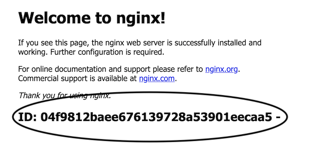

# random-docker-web-server
nginx:alpine with /dev/random added to index.html once prior to running nginx.  That unique ID stays the same during a single docker run.

Many times I need more than one webserver when testing a load balancer setup.  This allows a quick way to identify differences.  The md5sum nicely prints input 
from /dev/random onto the end of index.html.  Yes, the HTML is now badly formed. 

## Example

